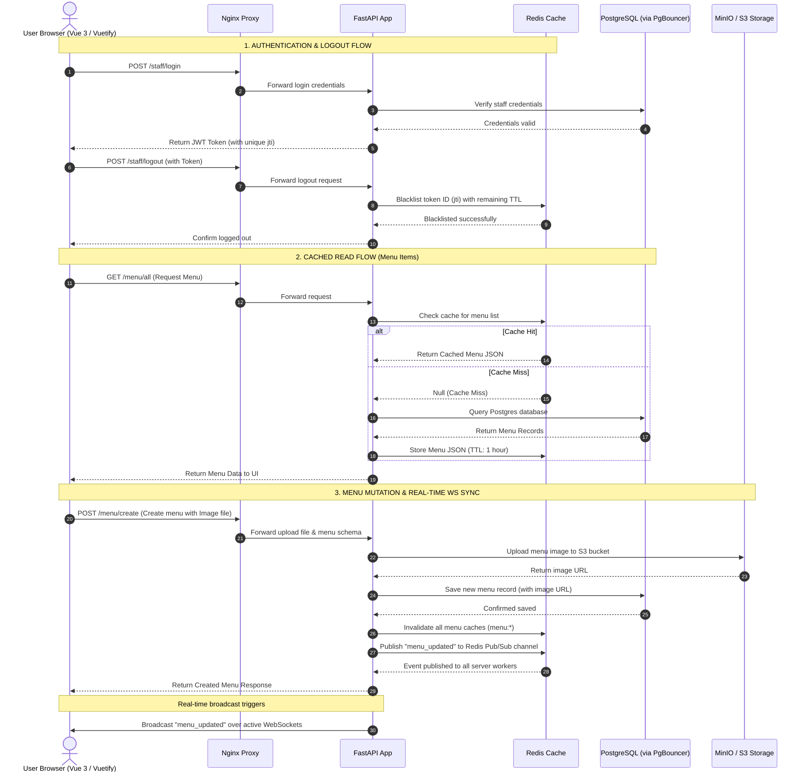

# FoodHub Complete System Architecture & Design

This document details the architectural layout, component flows, and data routing for both the **FoodHub FastAPI Backend** and the end-to-end **Frontend + Backend System**.

---

## 1. Backend Architecture & Design (Detailed Flow)

The backend layout leverages a high-performance stack that handles request filtering, security checks, in-memory caching, connection pooling, and persistent data storage.

### Architecture Component Diagram
```mermaid
graph TD
    Client[Client / Web Browser]
    
    subgraph ReverseProxy ["Nginx (Reverse Proxy)"]
        NginxProxy[Nginx Server: Port 80/443]
    end

    subgraph AppContainer ["FastAPI Backend (Port 8000)"]
        FastAPI[FastAPI Application]
        Limiter[SlowAPI Rate Limiter]
        AuthGuard[JWT Auth Guard]
        WS[WebSocket Manager]
        Controllers[API Controllers]
    end

    subgraph CacheStore ["Cache Store"]
        Redis[(Redis: Port 6379)]
    end

    subgraph DataStore ["Database Layer"]
        PgBouncer[(PgBouncer: Port 6432)]
        Postgres[(PostgreSQL: Port 5432)]
    end

    subgraph ObjectStorage ["Object Storage"]
        Minio[(MinIO / S3: Port 9000)]
    end

    %% Client Request Path
    Client -->|HTTP / WebSocket| NginxProxy
    NginxProxy -->|Forward with X-Real-IP| FastAPI
    
    %% FastAPI Internal Checks
    FastAPI --> Limiter
    Limiter -->|Query / Update Limits| Redis
    
    FastAPI --> AuthGuard
    AuthGuard -->|Check Blacklisted JTI| Redis
    
    %% Controllers and Caching
    FastAPI --> Controllers
    Controllers -->|Cache Lookup / Write| Redis
    Controllers -->|Store Images| Minio
    
    %% Connection Pooling Paths
    Controllers -->|Direct Query (Active)| Postgres
    Controllers -.->|Pooled Query (If Enabled)| PgBouncer
    PgBouncer --> Postgres
```

### Explanations of Backend Integrations:
1. **Nginx (Reverse Proxy)**: 
   * Configured on port `80`/`443` as the entry gate.
   * Forwards client requests to uvicorn/FastAPI (port `8000`).
   * Appends client IP headers (`X-Real-IP`, `X-Forwarded-For`), which are critical for rate limiting.
2. **SlowAPI Rate Limiter**:
   * Evaluates incoming requests per IP (e.g., maximum `/login` attempts).
   * Stores rate-limiting counters inside **Redis**.
3. **JWT Auth Guard**:
   * Intercepts authenticated routes, extracts the token ID (`jti`), and queries **Redis** to ensure the token has not been blacklisted (revoked via `/logout`).
4. **Redis Cache (Port 6379)**:
   * **JWT Blacklist**: Fast lookup for logged-out tokens.
   * **Menu Cache**: Stores serialized JSON menus with a 1-hour expiration time (TTL) to bypass DB lookups.
   * **WebSocket Hub**: Syncs messages across multi-process workers via Redis Pub/Sub.
5. **PgBouncer (Port 6432) & PostgreSQL (Port 5432)**:
   * **PgBouncer** is configured in `transaction` mode. It intercepts database connection requests, limiting actual active database connection sockets on PostgreSQL to `25` while serving up to `1000` concurrent clients.
   * If PgBouncer is deactivated, the backend connects directly to PostgreSQL on port `5432`. If activated, the backend connects to port `6432`.

---

## 2. Complete End-to-End System Architecture (Frontend + Backend)

This diagram shows how the Vue 3 + Vuetify client app communicates with the infrastructure to fetch data, handle file uploads, and receive real-time notifications.



---

## 3. Component Directory Mapping

Here is where the configurations and code blocks you've set up reside within your folders:

* **Nginx Configuration**: [nginx.conf](file:///C:/Users/LENOVO/Desktop/QUANTUM/QUANTUM%20TOOLS/FoodHubFolder/FoodHub/fastapi-foodhub-project/nginx/nginx.conf)
* **PgBouncer Configuration**: [pgbouncer.ini](file:///C:/Users/LENOVO/Desktop/QUANTUM/QUANTUM%20TOOLS/FoodHubFolder/FoodHub/fastapi-foodhub-project/pgbouncer/pgbouncer.ini)
* **Redis Connection Init**: [redis.py](file:///C:/Users/LENOVO/Desktop/QUANTUM/QUANTUM%20TOOLS/FoodHubFolder/FoodHub/fastapi-foodhub-project/src/utils/redis.py)
* **Rate Limiter Configuration**: [limiter.py](file:///C:/Users/LENOVO/Desktop/QUANTUM/QUANTUM%20TOOLS/FoodHubFolder/FoodHub/fastapi-foodhub-project/src/utils/limiter.py)
* **JWT Guard / Blacklist Check**: [helpers.py](file:///C:/Users/LENOVO/Desktop/QUANTUM/QUANTUM%20TOOLS/FoodHubFolder/FoodHub/fastapi-foodhub-project/src/utils/helpers.py#L35-L39)
* **Menu Caching & Cache Invalidation**: [controller.py](file:///C:/Users/LENOVO/Desktop/QUANTUM/QUANTUM%20TOOLS/FoodHubFolder/FoodHub/fastapi-foodhub-project/src/menu/controller.py#L111-L177)
* **Distributed WebSockets**: [ws_manager.py](file:///C:/Users/LENOVO/Desktop/QUANTUM/QUANTUM%20TOOLS/FoodHubFolder/FoodHub/fastapi-foodhub-project/src/utils/ws_manager.py)
